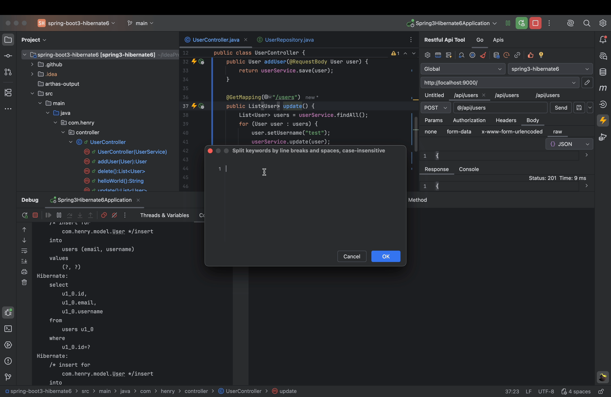

<h2>Hibernate SQL Log Viewer – Full SQL Debugging Made Easy</h2>

<strong>Hibernate SQL Log Viewer</strong> is a lightweight yet powerful IntelliJ IDEA plugin designed to make <strong>Hibernate SQL debugging</strong> simple, clear, and efficient.

It automatically displays complete SQL statements, including <strong>bound parameters</strong>, directly in your console or IDE window. No more guessing what Hibernate is actually executing!

<h3>Key Features</h3>
<ul>
  <li><strong>Full SQL Output</strong> – View real executable SQL statements with parameter values.</li>
  <li><strong>One-Click Activation</strong> – No configuration changes or code modifications required.</li>
  <li><strong>Smart SQL Filtering</strong> – Quickly filter logs by keywords, methods, or HTTP requests.</li>
  <li><strong>Performance Insights</strong> – Monitor SQL execution time to locate bottlenecks instantly.</li>
</ul>

<h3>Why Developers Love It</h3>

Perfect for developers using <strong>Hibernate ORM</strong>, <strong>Spring Boot</strong>, or <strong>JPA</strong> who want better visibility into database operations.
With this plugin, debugging and performance tuning of Hibernate queries becomes effortless.

<h3>Keywords</h3>

<em>hibernate sql log, hibernate sql logger, hibernate sql debugging, show sql with parameters, hibernate performance monitor, hibernate plugin, intellij plugin, jpa sql log</em>

<small>Compatible with IntelliJ IDEA Ultimate and other JetBrains IDEs.</small>

---

https://plugins.jetbrains.com/embeddable/install/28166

<table>
    <tr>
        <td></td>
    </tr>
</table>